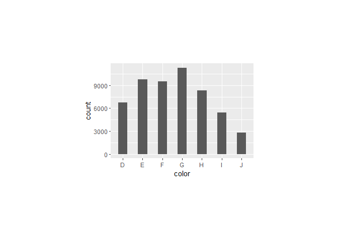
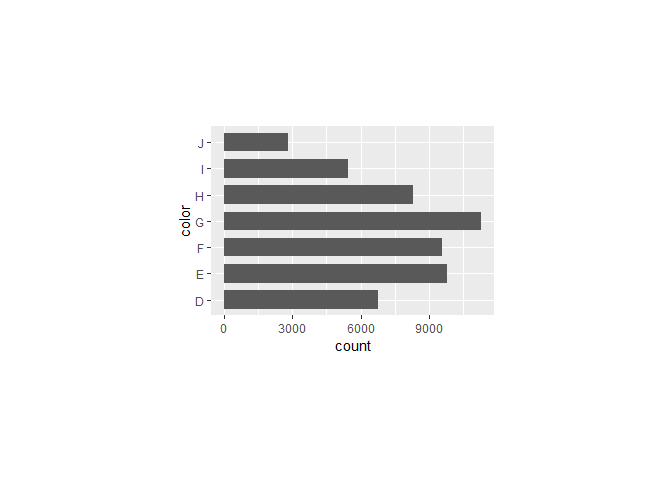

<!-- README.md is generated from README.Rmd. Please edit that file -->

# ggwidth <a href="https://davidhodge931.github.io/ggwidth/"></a>

<!-- badges: start -->

[](https://CRAN.R-project.org/package=ggwidth)
<!-- badges: end -->

The objective of ggwidth is to standardise ‘ggplot2’ geom width.

It provides methods to ensure the width in ggplot2 geoms are visually
consistent across plots with different numbers of categories, panel
dimensions, and orientations.

It works with geoms such as `geom_bar`/`geom_col`, `geom_boxplot` and
`geom_errorbar`.

Note this function requires:

- a set theme with panel widths and heights specified
- `"x"` orientation plots to have a x discrete scale with default expand
- `"y"` orientation plots to have a y discrete scale with default
  expand.

## Installation

Install from CRAN, or development version from
[GitHub](https://github.com/).

``` r
install.packages("ggwidth") 
pak::pak("davidhodge931/ggwidth")
```

``` r
library(ggplot2)
library(dplyr)
library(ggwidth)
library(patchwork)

set_theme(
  theme_grey() +
    theme(panel.widths  = rep(unit(75, "mm"), 2)) +
    theme(panel.heights = rep(unit(50, "mm"), 2))
)

set_equiwidth(1)
```

``` r
p1 <- mpg |>
  ggplot(aes(x = drv)) +
  geom_bar(
    width = get_width(n = 3),
    colour = "black",
    fill = "grey",
  )

p2 <- diamonds |>
  ggplot(aes(x = color)) +
  geom_bar(
    width = get_width(n = 7),
    colour = "black",
    fill = "grey",
  )

p3 <- diamonds |>
  ggplot(aes(y = color)) +
  geom_bar(
    width = get_width(n = 7, orientation = "y"),
    colour = "black",
    fill = "grey",
  )

p4 <- mpg |>
  ggplot(aes(x = drv, group = factor(cyl))) +
  geom_bar(
    position = position_dodge(preserve = "single"),
    width = get_width(n = 3, n_dodge = 4),
    colour = "black",
    fill = "grey",
  ) 

p1 + p2 + p3 + p4
```


``` r
d <- tibble::tibble(
  continent = c("Europe", "Europe", "Europe", "Europe", "Europe",
                "South America", "South America"),
  country   = c("AT", "DE", "DK", "ES", "PK", "TW", "BR"),
  value     = c(10L, 15L, 20L, 25L, 17L, 13L, 5L)
)

max_n <- d |>
  count(continent) |>
  pull(n) |>
  max()

d |>
  mutate(country = forcats::fct_rev(country)) |>
  ggplot(aes(y = country, x = value)) +
  geom_col(
    width = get_width(n = max_n, orientation = "y"),
    colour = "black",
    fill = "grey",
  ) +
  facet_wrap(~continent, scales = "free_y") +
  scale_y_discrete(continuous.limits = c(1, max_n)) +
  coord_cartesian(reverse = "y", clip = "off")
```



``` r
mpg |>
  ggplot(aes(x = drv)) +
  geom_bar(
    width = get_width(n = 3, panel_widths = unit(160, "mm")),
    colour = "black",
    fill = "grey",
  ) +
  theme(panel.widths = unit(160, "mm"))
```


