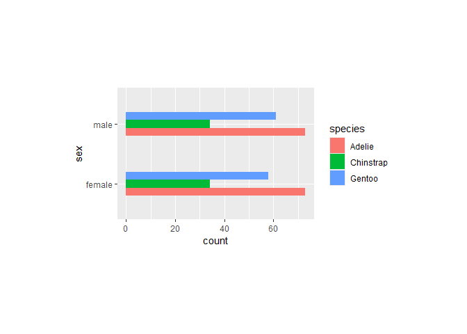
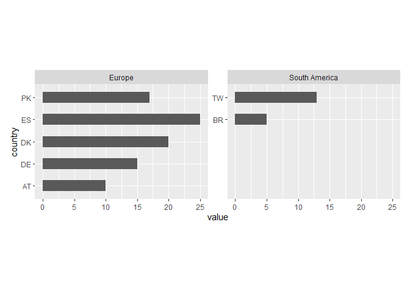
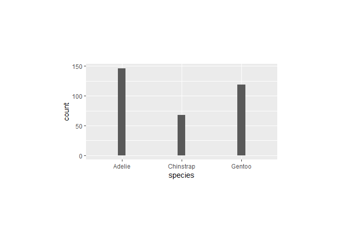

<!-- README.md is generated from README.Rmd. Please edit that file -->

# ggwidth

<!-- badges: start -->

<!-- badges: end -->

The objective of ggwidth is to standardise the appearance of the width
of bars etc.

Note this function:

- requires a set theme with panel widths and heights specified
- requires `"x"` orientation plots to have a x discrete scale with
  default expand
- requires `"y"` orientation plots to have a y discrete scale with
  default expand.

## Installation

You can install the development version of ggwidth from
[GitHub](https://github.com/) with:

``` r
# install.packages("pak")
pak::pak("davidhodge931/ggwidth")
```

``` r
library(ggplot2)
library(dplyr)
#> 
#> Attaching package: 'dplyr'
#> The following objects are masked from 'package:stats':
#> 
#>     filter, lag
#> The following objects are masked from 'package:base':
#> 
#>     intersect, setdiff, setequal, union
library(ggwidth)

set_theme(
  theme_grey() +
    theme(panel.widths  = rep(unit(75, "mm"), 2)) +
    theme(panel.heights = rep(unit(50, "mm"), 2))
)

set_equiwidth(1)
```

``` r
palmerpenguins::penguins |>
  filter(!is.na(sex)) |>
  ggplot(aes(x = species)) +
  geom_bar(
    width = get_width(n = 3)
  )
```


``` r
diamonds |>
  ggplot(aes(x = color)) +
  geom_bar(
    width = get_width(n = 7)
  )
```


``` r
diamonds |>
  ggplot(aes(y = color)) +
  geom_bar(
    width = get_width(n = 7, orientation = "y")
  )
```


``` r
palmerpenguins::penguins |>
  filter(!is.na(sex)) |>
  ggplot(aes(x = sex, fill = species)) +
  geom_bar(
    position = position_dodge(),
    width = get_width(n = 2, n_dodge = 3)
  )
```


``` r
palmerpenguins::penguins |>
  tidyr::drop_na(sex) |>
  ggplot(aes(y = sex, fill = species)) +
  geom_bar(
    position = position_dodge(),
    width = get_width(n = 2, n_dodge = 3, orientation = "y")
  )
```



``` r
d <- tibble::tibble(
  continent = c("Europe", "Europe", "Europe", "Europe", "Europe",
                "South America", "South America"),
  country   = c("AT", "DE", "DK", "ES", "PK", "TW", "BR"),
  value     = c(10L, 15L, 20L, 25L, 17L, 13L, 5L)
)

max_n <- d |>
  count(continent) |>
  pull(n) |>
  max()

d |>
  mutate(country = forcats::fct_rev(country)) |>
  ggplot(aes(y = country, x = value)) +
  geom_col(
    width = get_width(n = max_n, orientation = "y")
  ) +
  facet_wrap(~continent, scales = "free_y") +
  scale_y_discrete(continuous.limits = c(1, max_n)) +
  coord_cartesian(reverse = "y", clip = "off")
```



``` r
palmerpenguins::penguins |>
  filter(!is.na(sex)) |>
  ggplot(aes(x = species)) +
  geom_bar(
    width = get_width(n = 3, panel_widths = unit(160, "mm")),
  ) +
  theme(panel.widths  = unit(160, "mm"))
```


