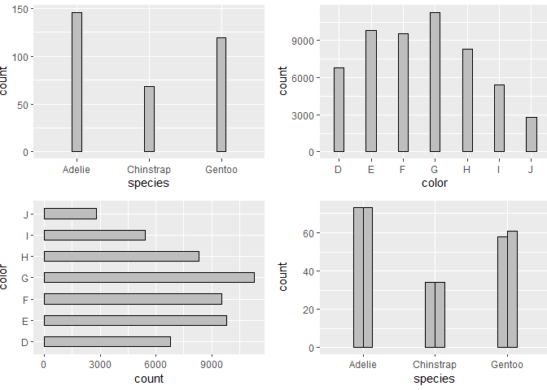
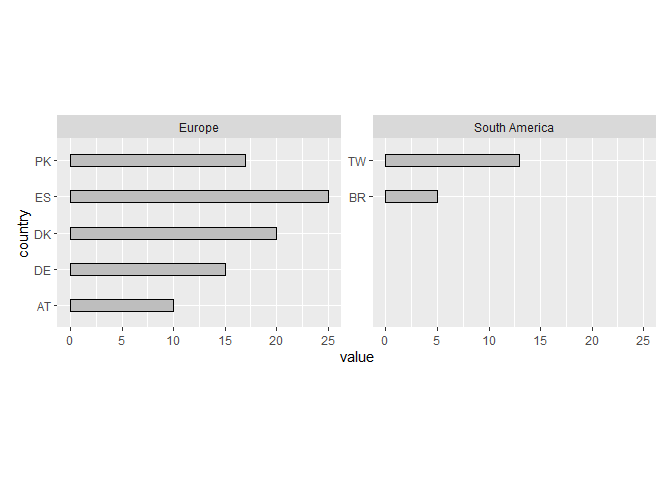
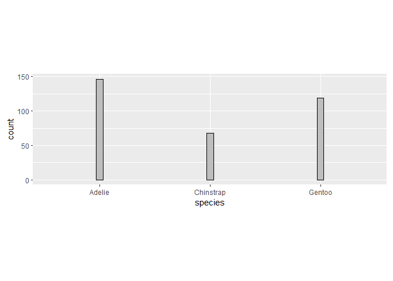

# ggwidth

The objective of ggwidth is to standardise ‘ggplot2’ geom width.

It provides methods to ensure the width in ggplot2 geoms are visually
consistent across plots with different numbers of categories, panel
dimensions, and orientations.

It works with geoms such as `geom_bar`/`geom_col`, `geom_boxplot` and
`geom_errorbar`.

Note this function:

- requires a set theme with panel widths and heights specified
- requires `"x"` orientation plots to have a x discrete scale with
  default expand
- requires `"y"` orientation plots to have a y discrete scale with
  default expand.

## Installation

Install from CRAN, or development version from
[GitHub](https://github.com/).

``` r
install.packages("ggwidth") 
pak::pak("davidhodge931/ggwidth")
```

``` r
library(ggplot2)
library(dplyr)
#> 
#> Attaching package: 'dplyr'
#> The following objects are masked from 'package:stats':
#> 
#>     filter, lag
#> The following objects are masked from 'package:base':
#> 
#>     intersect, setdiff, setequal, union
library(ggwidth)
library(patchwork)

set_theme(
  theme_grey() +
    theme(panel.widths  = rep(unit(75, "mm"), 2)) +
    theme(panel.heights = rep(unit(50, "mm"), 2))
)

set_equiwidth(1)
```

``` r
p1 <- palmerpenguins::penguins |>
  filter(!is.na(sex)) |>
  ggplot(aes(x = species)) +
  geom_bar(
    width = get_width(n = 3),
    colour = "black", 
    fill = "grey",
  )

p2 <- diamonds |>
  ggplot(aes(x = color)) +
  geom_bar(
    width = get_width(n = 7),
    colour = "black", 
    fill = "grey",
  )

p3 <- diamonds |>
  ggplot(aes(y = color)) +
  geom_bar(
    width = get_width(n = 7, orientation = "y"),
    colour = "black", 
    fill = "grey",
  )

p4 <- palmerpenguins::penguins |>
  filter(!is.na(sex)) |>
  ggplot(aes(x = species, group = sex)) +
  geom_bar(
    position = position_dodge(preserve = "single"),
    width = get_width(n = 3, n_dodge = 2),
    colour = "black", 
    fill = "grey",
  )

p1 + p2 + p3 + p4
```



``` r
d <- tibble::tibble(
  continent = c("Europe", "Europe", "Europe", "Europe", "Europe",
                "South America", "South America"),
  country   = c("AT", "DE", "DK", "ES", "PK", "TW", "BR"),
  value     = c(10L, 15L, 20L, 25L, 17L, 13L, 5L)
)

max_n <- d |>
  count(continent) |>
  pull(n) |>
  max()

d |>
  mutate(country = forcats::fct_rev(country)) |>
  ggplot(aes(y = country, x = value)) +
  geom_col(
    width = get_width(n = max_n, orientation = "y"),
    colour = "black", 
    fill = "grey",
  ) +
  facet_wrap(~continent, scales = "free_y") +
  scale_y_discrete(continuous.limits = c(1, max_n)) +
  coord_cartesian(reverse = "y", clip = "off")
```



``` r
palmerpenguins::penguins |>
  filter(!is.na(sex)) |>
  ggplot(aes(x = species)) +
  geom_bar(
    width = get_width(n = 3, panel_widths = unit(160, "mm")),
    colour = "black", 
    fill = "grey",
  ) +
  theme(panel.widths  = unit(160, "mm"))
```


